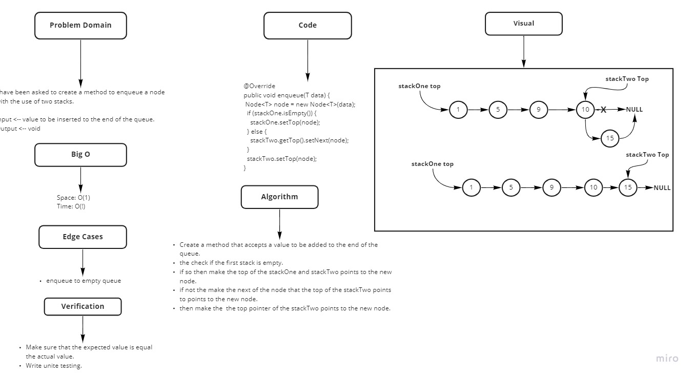
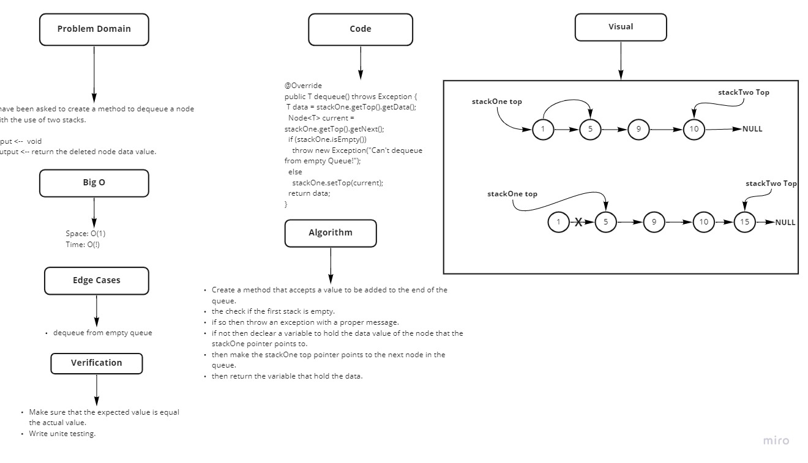

# Challenge Summary

<!-- Description of the challenge -->
Form a queue from two stacks and perform enqueue and dequeue operation on it.

## Whiteboard Process

<!-- Embedded whiteboard image -->



## Approach & Efficiency

<!-- What approach did you take? Why? What is the Big O space/time for this approach? -->

Big O{

- Enqueue -> space: O(1), time: O(1).
- Dequeue -> space: O(1), time: O(1).

}

## Solution
<!-- Show how to run your code, and examples of it in action -->

```java
just click on the green run button

  PseudoQueue<String> queue=new PseudoQueue<String>();
  queue.enqueue("added");
  queue.enqueue("Max");
  queue.enqueue("Mac");
  queue.enqueue("Mohammad");
  queue.enqueue("Tariq");
  System.out.println(queue);
  try{
  System.out.println(queue.dequeue());
  System.out.println(queue);
  }catch(Exception e){
  e.printStackTrace();
  }
```
