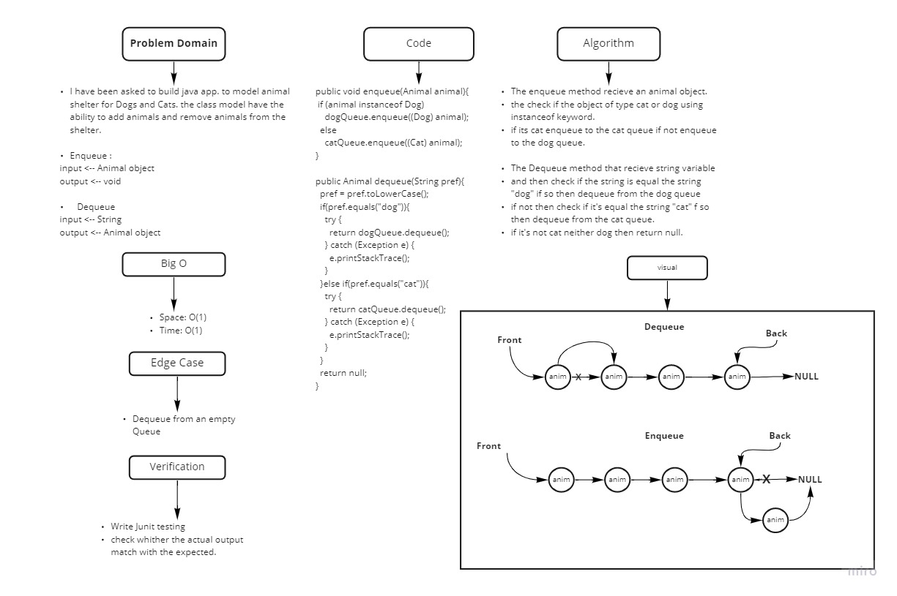

# Challenge Summary

<!-- Description of the challenge -->
I have been asked to build java app. to model animal shelter for Dogs and Cats. the class model have the ability to add
animals and remove animals from the shelter.

## Whiteboard Process

<!-- Embedded whiteboard image -->



## Approach & Efficiency

<!-- What approach did you take? Why? What is the Big O space/time for this approach? -->

Big O{

- enqueue => space: O(1), time: O(1).
- dequeue => space: O(1), time: O(1). }

## Solution

<!-- Show how to run your code, and examples of it in action -->

Just hit the green run button

```java
 Animal dog=new Dog("patio","tacoma",3);
  Animal dog2=new Dog("jackson","petcy",2);

  Animal cat=new Cat("klara","wafillo",4);
  Animal cat2=new Cat("Sacramento","wafillo",4);
  Animal cat3=new Cat("denver","wafillo",4);

  AnimalShelter animalShelter=new AnimalShelter();

  animalShelter.enqueue(dog);
  animalShelter.enqueue(dog2);
  animalShelter.enqueue(cat);
  animalShelter.enqueue(cat2);
  animalShelter.enqueue(cat3);

  System.out.println(animalShelter);

  System.out.println(animalShelter.dequeue("Dog"));

```

