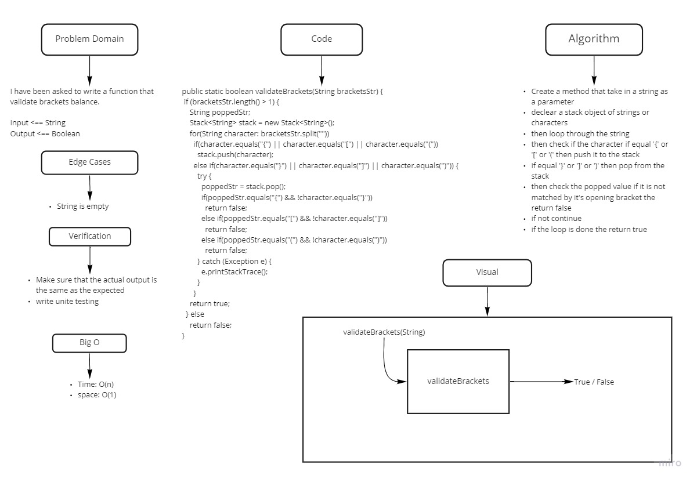

# Challenge Summary
<!-- Description of the challenge -->
## stack-queue-brackets

A java function that validate brackets balancing.

- i.g

`System.out.println(validateBrackets("(){}[[]]")); //should return true`

## Whiteboard Process
<!-- Embedded whiteboard image -->

## Approach & Efficiency
<!-- What approach did you take? Why? What is the Big O space/time for this approach? -->

Big O{
space: O(1)
time: O(n)
}
## Solution
<!-- Show how to run your code, and examples of it in action -->

call the function with a string as a parameter the run

` System.out.println(validateBrackets("(){}[[]]"));`
