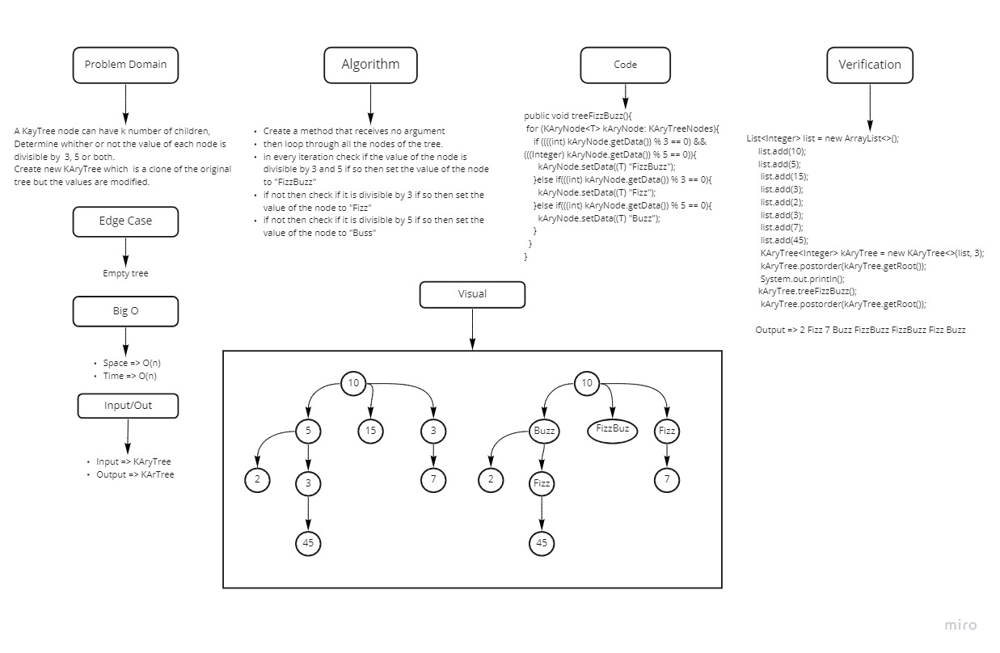

# Challenge Summary
<!-- Description of the challenge -->
Create  a method called fizz buzz tree that receives k-ary tree and return k-ary tree.

the method Determine whether the value of each node is divisible by 3, 5 or both. Create a new tree with the same structure as the original, but the values modified as follows:

- If the value is divisible by 3, replace the value with “Fizz”
- If the value is divisible by 5, replace the value with “Buzz”
- If the value is divisible by 3 and 5, replace the value with “FizzBuzz”
- If the value is not divisible by 3 or 5, simply turn the number into a String.

## Whiteboard Process
<!-- Embedded whiteboard image -->

## Approach & Efficiency
<!-- What approach did you take? Why? What is the Big O space/time for this approach? -->

Big O: Time => O(n) ,Space =>  Bog O(n).

## Solution
<!-- Show how to run your code, and examples of it in action -->
