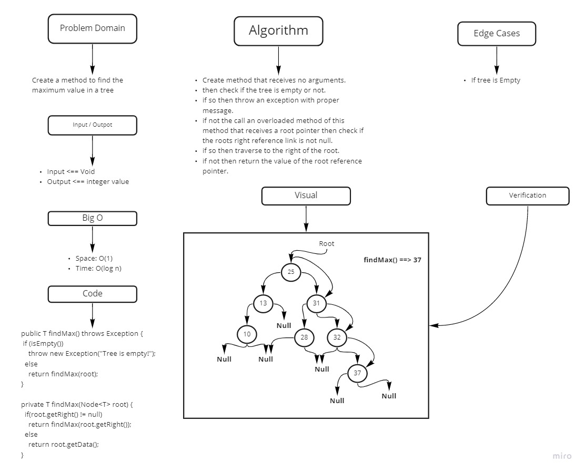

# Challenge Summary
<!-- Description of the challenge -->

findMax method that find the max value in a tree.

## Whiteboard Process
<!-- Embedded whiteboard image -->

## Approach & Efficiency
<!-- What approach did you take? Why? What is the Big O space/time for this approach? -->

Big O {
findMax => Space: O(1), Time: O(n)
}
## Solution
<!-- Show how to run your code, and examples of it in action -->

hit the run button
