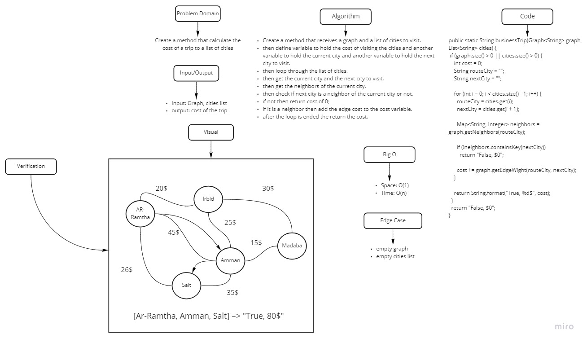

# Challenge Summary
<!-- Description of the challenge -->
Determine whether the trip is possible with direct flights, and how much it would cost.

## Whiteboard Process
<!-- Embedded whiteboard image -->

## Approach & Efficiency
<!-- What approach did you take? Why? What is the Big O space/time for this approach? -->
Big O => Space: O(1), Time: (n)

## Solution
<!-- Show how to run your code, and examples of it in action -->
