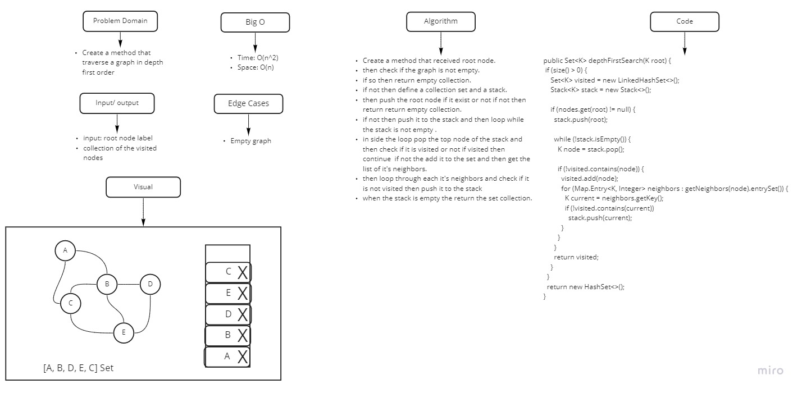

# Depth First Traversal

<!-- Short summary or background information -->

Depth-first search (DFS) is an algorithm for searching a graph or tree data structure. The algorithm starts at the
root (top) node of a tree and goes as far as it can down a given branch (path), then backtracks until it finds an
unexplored path, and then explores it.

## Challenge

<!-- Description of the challenge -->
implement graph depth first search in java

## Approach & Efficiency

<!-- What approach did you take? Why? What is the Big O space/time for this approach? -->
Big O => Space: O(n), Time: (n^2)

## Solution

<!-- Embedded whiteboard image -->

