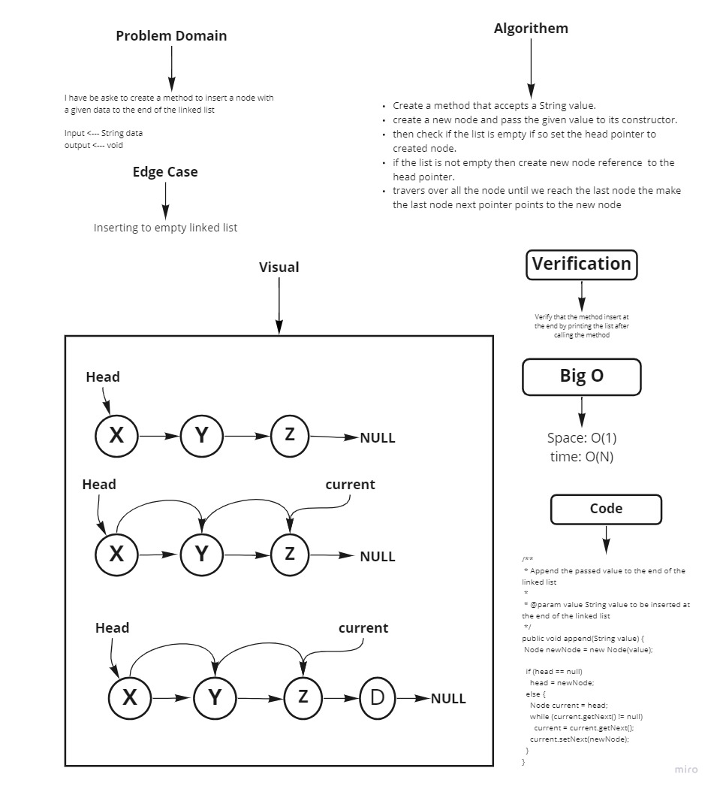
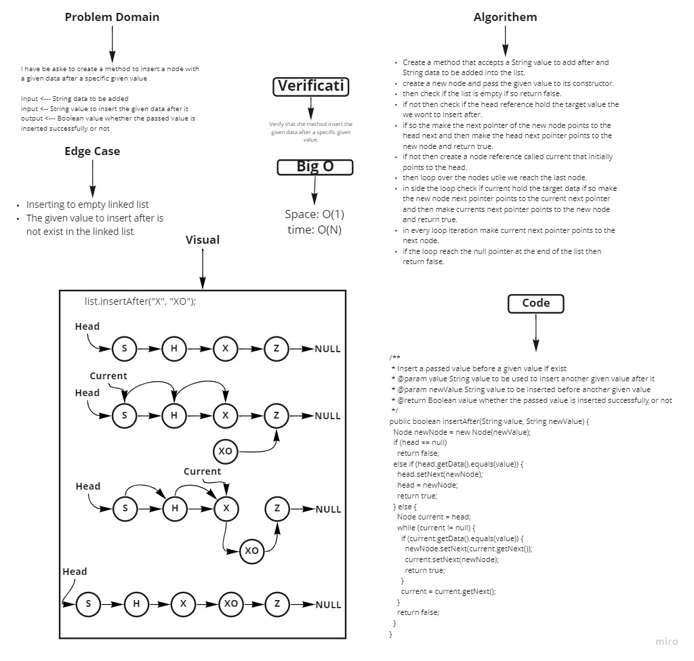

# Singly Linked List

A data structure which consist of a collection or a sequence of nodes each node contains data and a reference link to
the next node in the sequence.

## Challenge

Implement Linked List by creating Node class and Linked List class,
in side Linked List class implement methods to insert node in the list,
check weather a specific node exist in the linked list,
insert at the end of the linked list,
insert a node after a given value,
insert a node before a given value,
delete a given value from the liked list,
and toString method to print the linked list collection.

## Approach & Efficiency

Big O{
  insert: space => O(1), time => O(1)
  includes: space => O(1), time => O(n)
  append: space => O(1), time => O(n)
  insertBefore : space => O(1), time => O(n)
  insertAfter: space => O(1), time => O(n)
  delete: space => O(1), time => O(n)
  toString: space => O(1), time => O(n)
}

## API

insert => Inserts a given value in the beginning of the liked list.

includes => checks if a given value is exist in the linked list.

append => Insert a given value at the end of the linked list

insertBefore => Insert a given value before a specific value int rhe linked list

insertAfter => Insert a given value after a specific value int rhe linked list

delete => delete a specific node from the linked list contain a given value

toString => prints the linked list collection

## Whiteboard Process
<!-- Embedded whiteboard image -->







## Solution
<!-- Show how to run your code, and examples of it in action -->

```java
      public static void main(String[] args) {
  LinkedList list = new LinkedList();
  list.insert("S");
  list.insert("A");
  list.insert("D");
  list.append("YY");
  list.insert("G");
  System.out.println(list);
  System.out.println(list.insertBefore("D", "X"));
  System.out.println(list.insertAfter("X", "XYZ"));
  list.append("XY");
  list.insertBefore("XY", "X");
  System.out.println(list);
  list.delete("XY");
  System.out.println(list);
  list.delete("S");
  System.out.println(list.delete("zz"));
  System.out.println(list);

  }
```

