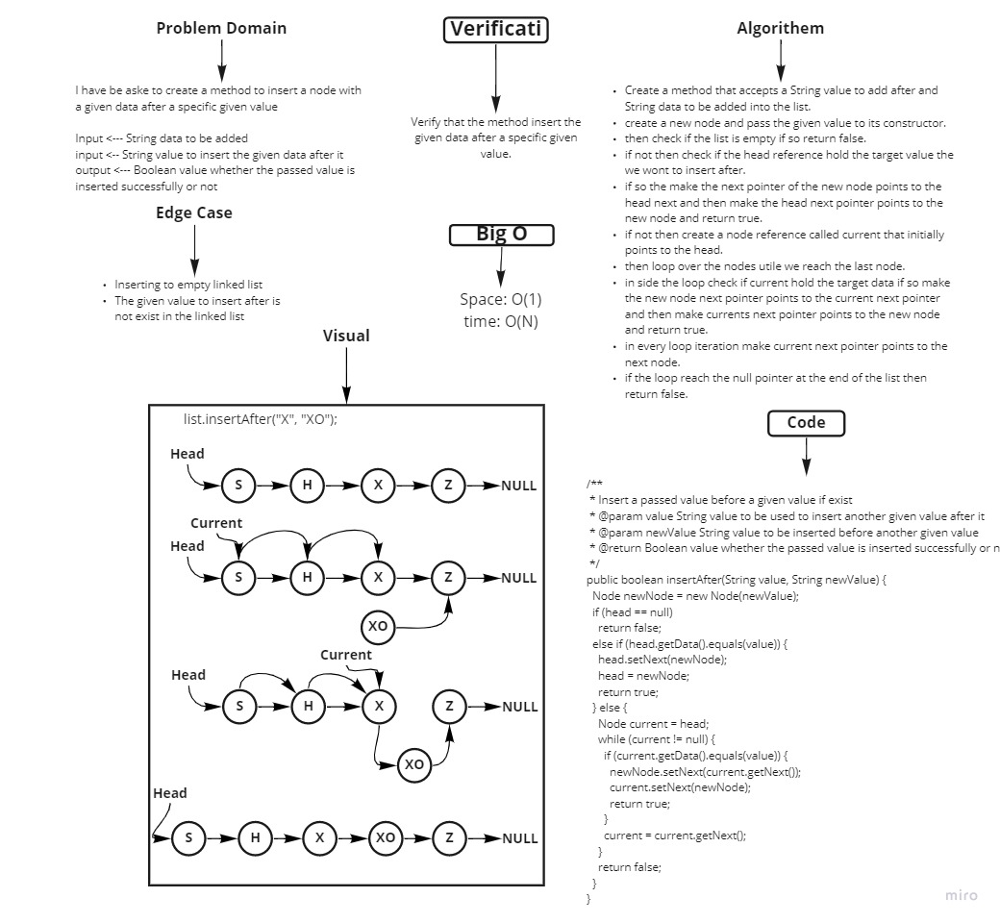

# Singly Linked List

A data structure which consist of a collection or a sequence of nodes each node contains data and a reference link to
the next node in the sequence.

## Challenge

Implement Linked List by creating Node class and Linked List class,
in side Linked List class implement methods:
- insert node in the list,
- check weather a specific node exist in the linked list,
- insert at the end of the linked list,
- insert a node after a given value,
- insert a node before a given value,
- delete a given value from the liked list,
- kthFromEnd returns the data stored in the Kth node counting from the end of the list
- toString method to print the linked list collection.
- zipLists method to zip two linked lists to gather and returned the zipped list

## Approach & Efficiency

Big O{
- insert: space => O(1), time => O(1)
- includes: space => O(1), time => O(n)
- append: space => O(1), time => O(n)
- insertBefore: space => O(1), time => O(n)
- insertAfter: space => O(1), time => O(n)
- delete: space => O(1), time => O(n)
- kthFromEnd: space => O(1), time => O(n)
- zipLists: space => O(1), time => O(n)
- toString: space => O(1), time => O(n)
  }

## API

- insert => Inserts a given value in the beginning of the liked list.

- includes => checks if a given value is exist in the linked list.

- append => Insert a given value at the end of the linked list

- insertBefore => Insert a given value before a specific value int rhe linked list

- insertAfter => Insert a given value after a specific value int rhe linked list

- delete => delete a specific node from the linked list contain a given value

- kthFromEnd => returns the data stored in the Kth node counting from the end of the list

- zipLists => return zipped list of two passed linked lists after zipping them to gather.

- toString => prints the linked list collection

## Whiteboard Process
<!-- Embedded whiteboard image -->





## Solution
<!-- Show how to run your code, and examples of it in action -->

Just hit the green Run button

```java
  public static void main(String[] args) {
  LinkedList list = new LinkedList();
  list.insert("S");
  list.insert("A");
  list.insert("D");
  list.append("YY");
  list.insert("GGG");
  list.insert("AX");
  list.insert("DT");
  list.append("ZZ");
  list.insert("RTX");

  LinkedList list2 = new LinkedList();
  list2.insert("Q");
  list2.insert("D");
  list2.insert("DD");
  list2.append("FX");
  list2.append("FR");
  list2.append("TX");
  list2.insertBefore("FX", "MN");
  list2.append("JG");
  list2.append("PL");
  list2.append("OO");
  list2.insertBefore("FX", "MX");

  System.out.println(list);
  System.out.println(list2);
  LinkedList list3 = null;
  try {
  list3 = LinkedList.zipLists(list, list2);
  } catch (Exception e) {
  e.printStackTrace();
  }
  System.out.println("The Zipped version => " + list3);

  }
```
