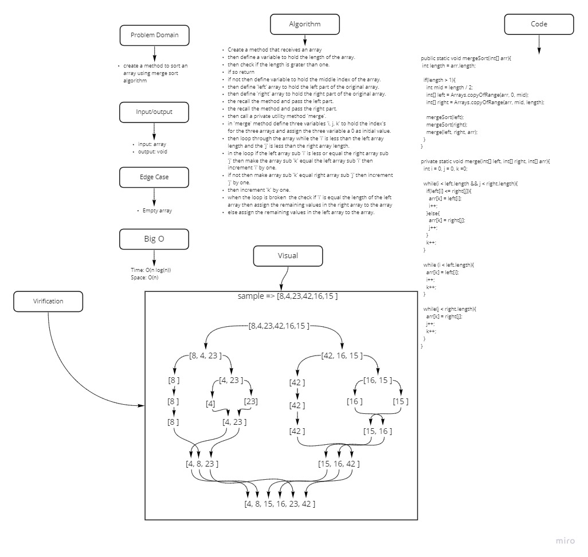

# Challenge Summary
<!-- Description of the challenge -->

Java implementation of mergesort using recursion.
## Whiteboard Process
<!-- Embedded whiteboard image -->

## Approach & Efficiency
<!-- What approach did you take? Why? What is the Big O space/time for this approach? -->

Big O{
  Space: O(n),
  Time: O(n log(n))
}

## Solution
<!-- Show how to run your code, and examples of it in action -->
